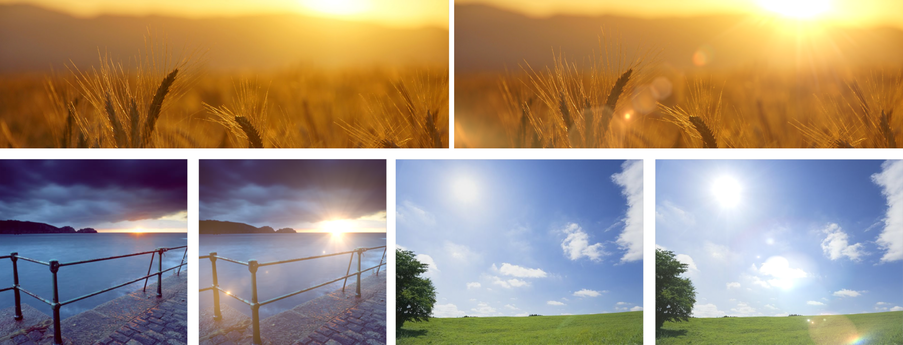

# Nuke LensFlare Gizmo Project

The aim of this project was to create user friendly lens flare gizmo in Nuke, with usage Blink Scripting.

The motivation behind the topic is the exploration of technical capacities of one of the compositing software in accordance to creation cameras post-effects and looking into the mechanism of constructing user friendly tool for lens flare effect.

## Requirements:

- Foundry Nuke 9.0 or above (https://www.foundry.com/products/nuke)

## Running the system:

Copy the gizmo into a folder in your Nuke plugin path, for example your home directory's ".nuke" folder.

## Repository Structure

- *Code*. This floder contains initial code, which were used as a main core of the tool.

- *Scene*. This folder contains gizmo and example of the Nuke script.

## Acknowledgements

The author thanks Alexei Selivanov from Main Road|Post for significant help in research and implementation the final tool. The author also thanks Dmitrii Kirilliak from Technicolor Mr.X for feedback and help in preparation examples.

## References

Image references:
- Paisajes, N. [n. d.]. Wheat field grass Macro sunrise sunset hot [photograph]. Available from: https://www.pinterest.co.uk/pin/570198002820341007/?lp=true [Accessed 20 May 2019].
- Hanafy, N., [n. d.]. Other picture of photography landscape. [photography] Available from: http://nadiafineartphotography.blogspot.com/2011/02/black-and-white-in-photography.html#comment-form [Accessed 21 May 2019]
- Bourne, R., [n.d.]. The bright blessed day [photography] Available from: https://www.pinterest.co.uk/pin/56506170297601149/?lp=true [Accessed 21 May 2019]

